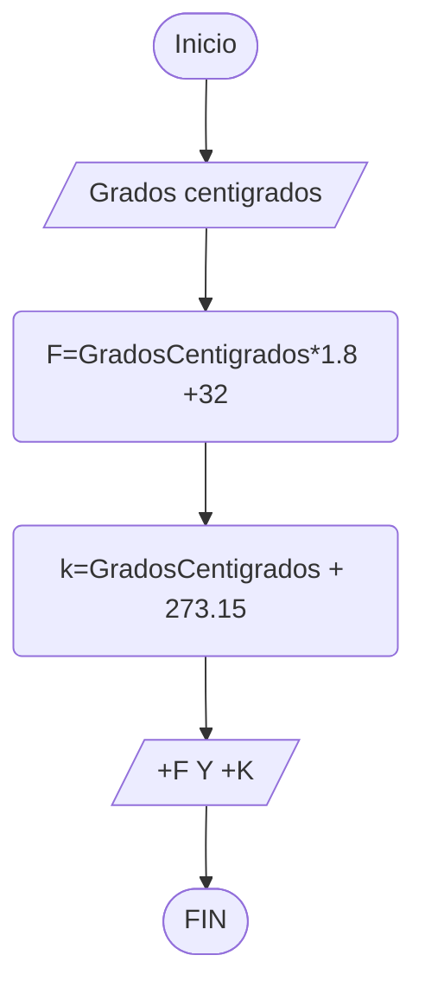

**EXAMEN DAM**

*Ejercicio 1 y 2*

1. Git clone
Tras esto hago moadificación del documento
2. Git add README.md
3. GIt status
4. Git commit -m "primera modificacion"
5. Git remote add origin
6. Git push -u origin main
7. 
***Ejercicio 3***

Accedo al boletin 

1. Git add
2. Git status
3. Git config user.name "AmestoyyJorge"
4. Git commit -m "boletin"
5. Git log
6. GIt push -u origin main

***Ejercicios 5 y 6***
1. git tag -a v1.0 -m "primer tag"
2. git push origin v1.0

Release
1. Creo artifact desde la interfaz de intellij
2. (Project structure-Artifact...-Build)
3. Jar creado
4. En el repositorio->Release-> Muevo Jar

